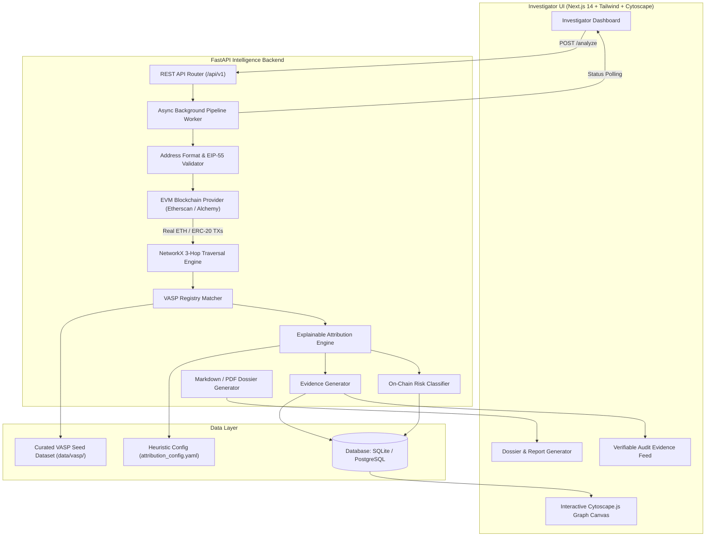

# SIH Cryptocurrency Wallet-to-VASP Attribution Platform

> **Problem Statement**: Automated Attribution of Unknown Cryptocurrency Wallets to Nearest Virtual Asset Service Providers (VASPs) through Blockchain Intelligence APIs.

[](https://fastapi.tiangolo.com)
[](https://nextjs.org)
[](https://networkx.org)
[](https://www.sqlalchemy.org)

---

## 📌 Executive Summary

This platform is a **working, deterministic blockchain intelligence engine** built for Smart India Hackathon (SIH). It traces Ethereum transaction flows up to **3 hops**, identifies the nearest **Virtual Asset Service Providers (VASPs)** using a curated registry of publicly verified exchange clusters, calculates explainable attribution scores, classifies structural risk indicators, and provides investigators with an interactive Cytoscape.js graph and legal dossier generator.

### 🛡️ Core Guarantees:
- **100% Real Blockchain Data**: Queries real Ethereum explorer APIs (Etherscan / compatible providers). No synthetic or mock data is ever presented as real analysis.
- **Explainable Attribution**: Attribution scores (0–100) are computed mathematically via a configurable heuristic weighting system (`attribution_config.yaml`). No fake AI/LLM hallucinations.
- **Curated VASP Provenance**: Seeded with verified addresses from Etherscan verified labels, DefiLlama reserve proofs, and Arkham verified entities.
- **Zero-Setup Local Run**: Defaults to SQLite for instant out-of-the-box local execution, while fully supporting PostgreSQL in production.

---

## 🏗️ System Architecture



---

## 🚀 Quickstart Guide

### Prerequisites
- Python 3.11+
- Node.js 18+ and npm

### 1. Environment Setup
```bash
# Clone the repository and navigate to root
cd "sih retry"

# Copy example environment file
cp .env.example .env
```

*(Optional)* Add your free [Etherscan API Key](https://etherscan.io/apis) into `.env`:
```env
BLOCKCHAIN_API_KEY=your_api_key_here
BLOCKCHAIN_API_URL=https://api.etherscan.io/api
DATABASE_URL=sqlite+aiosqlite:///./crypto_trace.db
MAX_HOPS=3
```

---

### 2. Start the Backend API
```bash
# Install backend dependencies
pip install -r backend/requirements.txt

# Run FastAPI server
python -m uvicorn backend.app.main:app --port 8000 --reload
```
- API Swagger Docs: `http://localhost:8000/docs`
- Health Endpoint: `http://localhost:8000/api/v1/health`

---

### 3. Start the Investigator Frontend
```bash
cd frontend

# Install dependencies (already installed if performed earlier)
npm install

# Start Next.js dev server
npm run dev
```
- Open `http://localhost:3000` in your browser.

---

## 🧪 Running Automated Tests
```bash
# Run unit & integration test suite
python -m pytest tests/ -v
```

---

## 📚 Technical Documentation

- [ARCHITECTURE.md](docs/ARCHITECTURE.md): Component breakdown & pipeline flow
- [DATA_SOURCES.md](docs/DATA_SOURCES.md): Provenance of blockchain data & VASP seed dataset
- [METHODOLOGY.md](docs/METHODOLOGY.md): Graph traversal algorithms, scoring equations, and risk heuristics
- [LIMITATIONS.md](docs/LIMITATIONS.md): Technical boundaries, non-claims, and future cross-chain roadmap
- [API.md](docs/API.md): API documentation with request/response schemas
